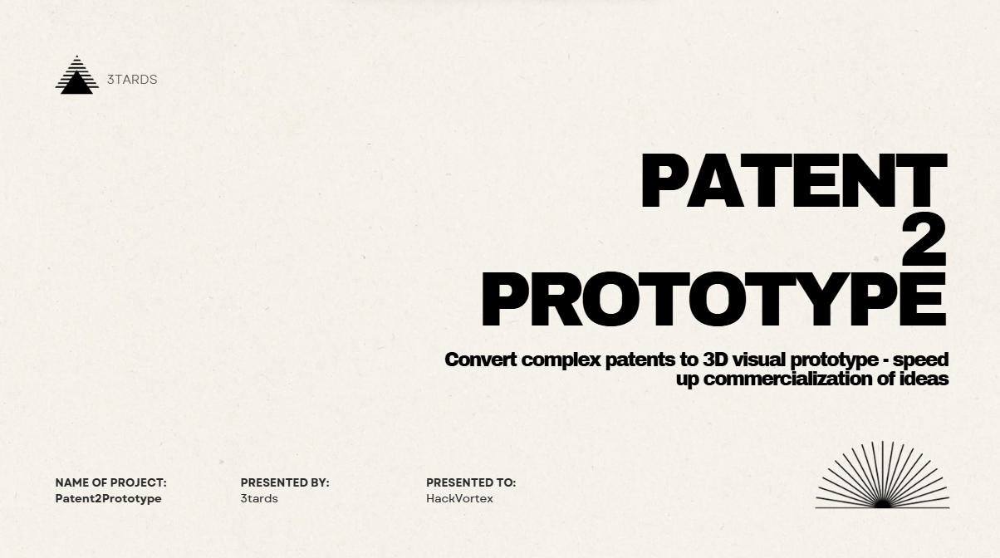

# 🧠 Patent2Prototype: Turning Patents into 3D Prototypes with AI

🚀 **Patent2Prototype** is an intelligent pipeline that transforms complex patent documents into accurate, structured 3D prototype instructions — in minutes.

---

## 🎥 5-Minute Pitch & Walkthrough

👉 [Click here to watch the pitch + demo »](https://www.loom.com/share/2643a4a66cf8418ea0af8bdbefaf3f0e?sid=fd6aee05-d618-4c5b-892e-7df27cf06726)

---

## 🧩 The Problem

Thousands of patents sit unread and underutilized due to their highly technical language and inaccessible diagrams. Engineers and makers often struggle to visualize or recreate what's been described — resulting in innovation bottlenecks.

---

## 💡 The Solution

**Patent2Prototype** uses the power of AI and multimodal LLMs to:
- Extract multi-modal data from pdfs
- Parse and understand lengthy patent documents 📜
- Analyze all embedded diagrams 🖼️
- Understand spatial alignment and component relationships 🔩
- Generate structured 3D code for rendering in **Three.js** 🧱

> From raw patent → to a working, visual 3D prototype — automatically.

---

## 🧠 How It Works

Our custom LangChain-powered pipeline works in 5 stages:

### Step 1: Understand the Patent 📘  
→ Splits patent text into logical sections and summarizes each one.  
→ Returns a concise **patent context** used downstream.

### Step 2: Interpret Diagrams 🖼️  
→ Uses vision-capable LLMs to analyze **all diagrams**.  
→ Extracts structure, positioning, and component names.

### Step 3: Analyze Assembly Logic 🛠️  
→ Merges insights from text + diagrams.  
→ Understands **how parts connect**, their spatial logic, and outputs a **build plan**.

### Step 4: Generate 3D Code 🧱  
→ Generates clean **Three.js code** to render the prototype in-browser.

### Step 5: Refine & Polish ✨  
→ Uses AI again to optimize the code for visual accuracy and performance.

---

## 🧪 Tech Stack

| Layer | Tech |
|------|------|
| 💬 LLM | OpenAI GPT-4o (Vision) |
| 🦜 LangChain | Orchestration + Chaining |
| 🧠 Logic | Custom prompt engineering |
| 🔍 Diagram Detection | YOLOv11 cropping |
| 🌐 3D Rendering | Three.js (WebGL) |
| 💻 Interface | Streamlit (WIP) |

---

## 📸 Demo Snapshot

---

---

## 🧑‍💻 Built With Love

Made by **Team 3Tards** 🧠  

---

## ⚖️ License

MIT License
